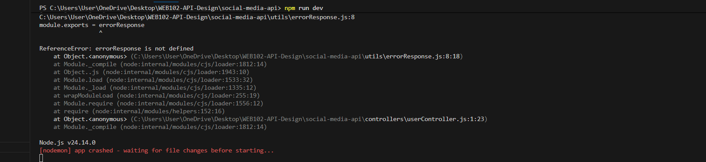

This practical helped me understand how to design and implement a RESTful API in a structured and professional way. I learned how to properly create endpoints for different resources such as users, posts, comments, likes, and followers. Each resource followed a consistent pattern using HTTP methods like GET, POST, PUT, and DELETE, which made the API organized and easy to understand.

One of the most important things I learned was how to design clean and meaningful URLs. Using endpoints like /users and /users/{id} makes the API more readable and follows best practices. I also understood the importance of using correct HTTP status codes such as 200, 201, and 404 to communicate responses clearly.

During the implementation part, I gained hands-on experience with Node.js and Express. Setting up the server, creating routes, and organizing the project into controllers and middleware improved my understanding of backend development. I also learned how middleware works, especially for error handling and formatting responses.

Another useful concept was content negotiation, which allows the API to return responses in different formats. Even though we used mock data instead of a database, it still helped me understand how data flows in an API.

Overall, this practical improved my knowledge of RESTful API design, backend structure, and real-world application development. It also gave me confidence to build more advanced APIs in the future using databases and authentication systems.

Challenges Faced
Project Folder Organization
Managing multiple folders like controllers, routes, middleware, and utils was confusing. I initially struggled to understand where each file should be placed.

Handling Errors and Status Codes
I faced issues in returning proper HTTP status codes and structured responses, especially for errors like 404 and 500

Debugging Issues
Sometimes the server did not run properly due to small syntax errors or missing dependencies, which took time to identify.

How I Overcame the Challenges
Followed Step-by-Step Structure
I carefully followed the practical instructions and organized my project into controllers, routes, and middleware, which improved my understanding of project structure.

Used Online Resources and Examples
I referred to examples and documentation to better understand middleware and Express.js functionality.

Stayed Consistent and Patient
I took time to carefully read errors and fix them instead of rushing, which helped me learn more effectively.